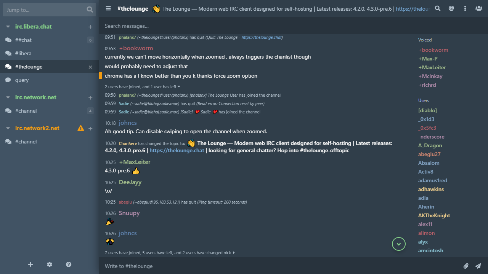

# New Morning
Dark, modern looking theme with conversational message layout for *[The Lounge](https://thelounge.chat/)* self-hosted web IRC client. Based on stock *Morning* theme.

## Features
- Updated to The Lounge 4.3.0-Pre.6 with styled message search bar.
- Message contents broken out into separate rows. Conecutive messages from same user are merged together.
- Hidden logos.
- Sidebar made slightly larger by default and can be resized by dragging it in bottom right corner (left of chat input box).
- Restyled channel join inputs and button.
- Restyled standard and condensed status messages.
- Restyled message highlights.
- Adjusted density for touchscreen devices.
- Bunch of other tweaks and fixes.

## Requirements
Tested on The Lounge 4.3.0-Pre.6.

## Install
`thelounge install thelounge-theme-new-morning`

## Acknowledgements
Nick colors taken from [thelounge-theme-nord](https://www.npmjs.com/package/thelounge-theme-nord).